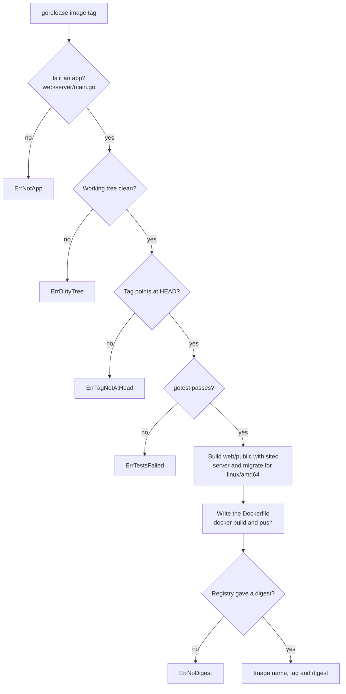

# Image flow

What `gorelease image` does. Every branch has a test in `tests/image_test.go`.

```mermaid
flowchart TD
    A[gorelease image tag] --> B{Is it an app?<br/>web/server/main.go}
    B -->|no| X0[ErrNotApp]
    B -->|yes| C{Working tree clean?}
    C -->|no| X1[ErrDirtyTree]
    C -->|yes| D{Tag points at HEAD?}
    D -->|no| X2[ErrTagNotAtHead]
    D -->|yes| E{gotest passes?}
    E -->|no| X3[ErrTestsFailed]
    E -->|yes| F[Build web/public with sitec<br/>server and migrate for linux/amd64]
    F --> G[Write the Dockerfile<br/>docker build and push]
    G --> H{Registry gave a digest?}
    H -->|no| X4[ErrNoDigest]
    H -->|yes| I[Image name, tag and digest]
```
